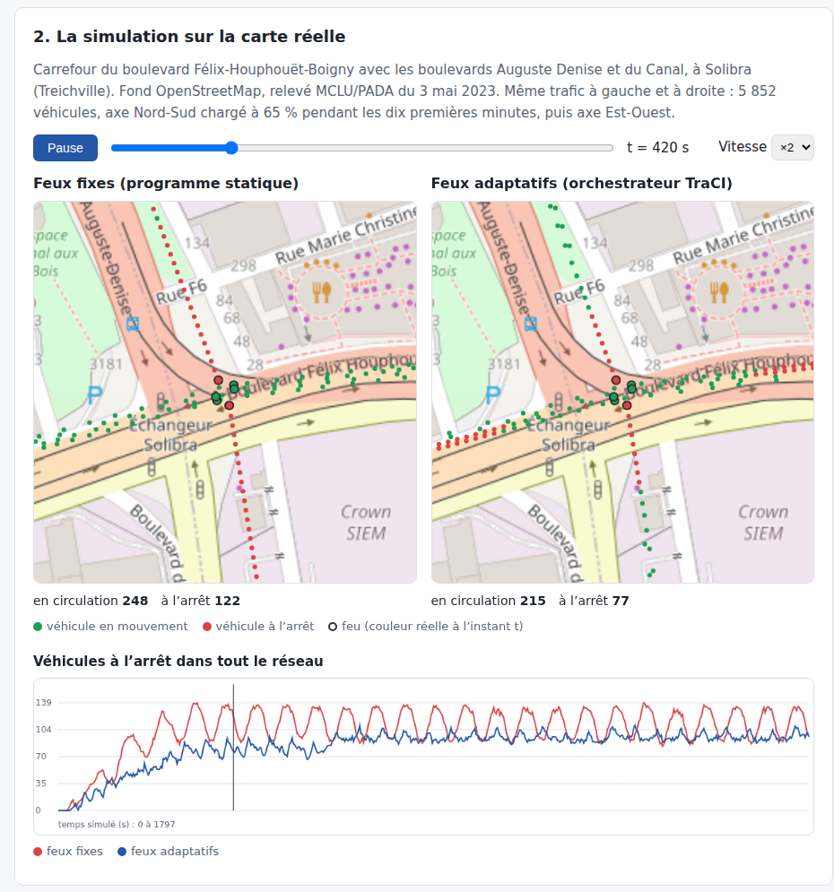
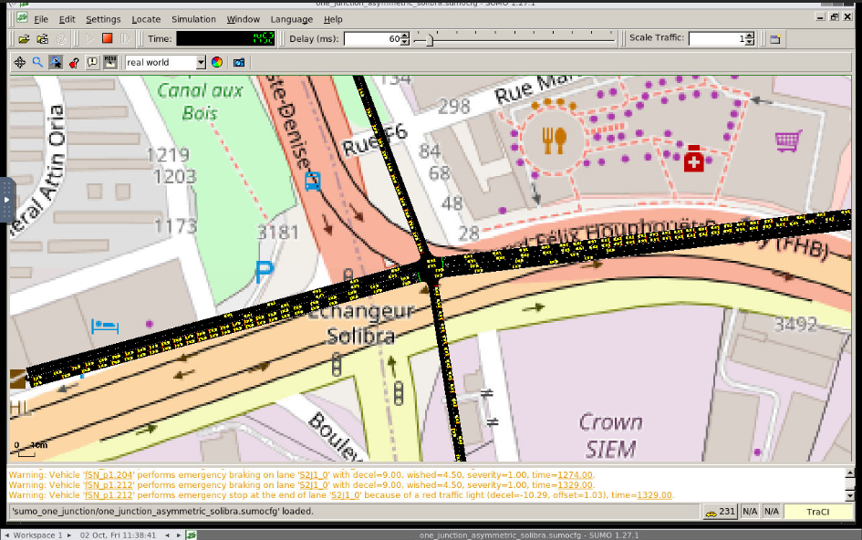

# Banc expérimental conteneurisé

Ce dossier rejoue, avec Docker, toutes les expériences du mémoire *Système de gestion
des embouteillages avec des feux tricolores connectés basé sur la technologie SDN*
(ACHI Jean Martial Zéphirin, Université Virtuelle de Côte d’Ivoire, soutenu le
25 septembre 2026). Tout est prêt à l’emploi : aucune installation de SUMO, Ryu,
Open vSwitch ou Python n’est nécessaire sur votre machine, seulement Docker.

## L’idée en une minute

Un feu à cycle fixe donne le même temps de vert à chaque axe, quelle que soit la
demande. Quand le trafic devient asymétrique, l’axe chargé accumule une file pendant
que l’axe vide reçoit du vert inutile. Le projet relie les feux à un contrôleur :

1. **Mesurer** : le simulateur SUMO fait rouler les véhicules ; un orchestrateur lit
   les files de chaque axe chaque seconde (interface TraCI).
2. **Décider** : il donne le vert à l’axe le plus chargé (vert de 10 à 45 s).
3. **Protéger** : il publie la charge au contrôleur SDN Ryu, qui place le flux de
   commande des feux dans une file prioritaire OpenFlow, pour que les ordres arrivent
   même quand le réseau est saturé.
4. **Secourir** : à l’échelle d’Abidjan, chaque secteur (Nord, Sud) a un contrôleur de
   secours qui reprend la main en cas de panne.

Le banc est organisé en **deux niveaux** :

| Niveau | Commande | Objet |
|---|---|---|
| 1. Reproduction du mémoire | `make memoire` | Rejoue à l’identique les expériences du chapitre 3 et compare chaque valeur mesurée à la valeur publiée |
| 2. Option évoluée | `make evolue` | Démonstration visuelle sur la carte réelle, contrôleurs par secteur avec secours, carrefour réel de Solibra, interface graphique SUMO |

Voir aussi [ARCHITECTURE.md](ARCHITECTURE.md) (composants et flux de décision) et
[VALIDATION.md](VALIDATION.md) (valeurs réellement mesurées, comparées au mémoire).

## Sommaire

0. [Voir le projet en trois commandes](#0-voir-le-projet-en-trois-commandes)
1. [Prérequis et installation de Docker](#1-prérequis-et-installation-de-docker)
2. [Démarrage complet](#2-démarrage-complet)
3. [Niveau 1 : reproduction du mémoire](#3-niveau-1--reproduction-du-mémoire)
4. [Niveau 2 : option évoluée](#4-niveau-2--option-évoluée)
5. [Paramètres](#5-paramètres)
6. [Fichiers produits](#6-fichiers-produits)
7. [Organisation du code](#7-organisation-du-code)
8. [Limites expérimentales](#8-limites-expérimentales)
9. [Dépannage](#9-dépannage)

## 0. Voir le projet en trois commandes

```bash
make build      # construit l'image, une seule fois (5 à 10 minutes)
make demo       # simule le carrefour réel de Solibra et produit la page de démonstration (1 minute)
make gui        # ouvre le vrai SUMO, piloté en direct par l'orchestrateur, dans le navigateur
```

- **`results_docker/demo.html`** s’ouvre dans n’importe quel navigateur, sans serveur.
  La page anime, sur le fond de carte OpenStreetMap du carrefour de Solibra
  (Treichville, Abidjan), les véhicules et la couleur réelle de chaque feu, côte à côte
  en feux fixes et en feux adaptatifs ; elle trace la courbe des véhicules à l’arrêt,
  reprend les résultats mesurés et en rédige une **interprétation automatique**
  (également écrite dans `results_docker/interpretation.md`).
- **`make gui`** : ouvrir http://localhost:6080/vnc.html?autoconnect=true&resize=scale.
  C’est l’interface graphique officielle de SUMO, sur le même fond de carte, avec les
  feux commandés en direct par l’orchestrateur. `MODE=fixe make gui` montre le même
  trafic en feux fixes. Arrêter avec `docker compose --profile gui down`.

Pour remplir aussi la section « Résultats mesurés » de la démonstration, lancer
`make memoire` puis `make demo`.



*`make demo` : à gauche les feux fixes, à droite les feux adaptatifs, même trafic au même
instant ; véhicules arrêtés en rouge, couleur réelle des feux au carrefour, et courbe des
véhicules à l’arrêt. La page complète, avec l’interprétation automatique, est dans
[docs/captures/demo_page_complete.png](docs/captures/demo_page_complete.png).*



*`make gui` : l’interface graphique officielle de SUMO, dans le navigateur, sur le fond
OpenStreetMap du carrefour de Solibra ; les feux sont commandés en direct par
l’orchestrateur (mode TraCI).*

## 1. Prérequis et installation de Docker

### 1.1 Ce qu’il faut

| Élément | Version conseillée | Vérification |
|---|---|---|
| Docker Engine ou Docker Desktop | 24 ou plus récent | `docker version` |
| Greffon Docker Compose | v2 | `docker compose version` |
| `make` et `git` | toute version | `make --version`, `git --version` |
| Espace disque | 4 Go libres | |
| Mémoire vive | 4 Go | |

Le banc utilise les espaces de noms réseau de Linux et Open vSwitch : il lui faut un
noyau Linux (directement, ou via WSL 2 sous Windows) avec `/dev/net/tun`. Pour mesurer
l’effet de la QoS en phase B, le module noyau `openvswitch` doit être disponible
(c’est le cas des noyaux Ubuntu et WSL 2 récents) ; sans lui, tout le reste fonctionne.

### 1.2 Installer Docker

**Windows 10/11** (le cas le plus courant) :

1. Dans PowerShell en administrateur : `wsl --install -d Ubuntu`, puis redémarrer.
2. Installer Docker Desktop (https://docs.docker.com/desktop/setup/install/windows-install/)
   et cocher « Use WSL 2 based engine » ; dans *Settings > Resources > WSL integration*,
   activer l’intégration avec Ubuntu.
3. Ouvrir le terminal Ubuntu et y lancer toutes les commandes de ce README :
   `sudo apt update && sudo apt install -y make git`.

**Ubuntu ou Debian** :

```bash
sudo apt update && sudo apt install -y ca-certificates curl make git
curl -fsSL https://get.docker.com | sudo sh        # script officiel d'installation
sudo usermod -aG docker "$USER"                    # puis se déconnecter et se reconnecter
sudo modprobe openvswitch                           # module noyau pour la phase B
```

**macOS** : installer Docker Desktop (https://docs.docker.com/desktop/setup/install/mac-install/)
et `make` (`xcode-select --install`). La phase A, la démonstration et l’interface
graphique fonctionnent ; la machine virtuelle de Docker Desktop ne fournissant pas le
module `openvswitch`, la phase B y vérifie OpenFlow mais ne mesure pas l’effet de la
QoS (voir [section 8](#8-limites-expérimentales)).

### 1.3 Vérifier l’installation

```bash
docker run --rm hello-world          # Docker fonctionne
docker compose version               # Compose v2 est présent
ls /dev/net/tun                      # interface TUN disponible (Linux, WSL)
lsmod | grep openvswitch             # module chargé (sinon : sudo modprobe openvswitch)
```

## 2. Démarrage complet

```bash
git clone https://github.com/jmazephgithun/Traffic-Congestion-Management-System-with-Connected-Traffic-Lights-based-on-SDN.git
cd Traffic-Congestion-Management-System-with-Connected-Traffic-Lights-based-on-SDN/experiments
make build          # construit l'image (une seule fois)
make test           # tests unitaires des analyseurs
make memoire        # niveau 1 complet, environ 30 minutes
make evolue         # niveau 2, environ 2 heures (montée en charge comprise)
make help           # rappel des cibles
```

Le rapport du niveau 1 est écrit dans `results_docker/rapport_memoire.md`, la
démonstration dans `results_docker/demo.html`.

## 3. Niveau 1 : reproduction du mémoire

`make memoire` enchaîne, dans cet ordre, les cibles ci-dessous. Chacune peut être
lancée seule.

| Cible | Mémoire | Ce qui est rejoué | Sortie |
|---|---|---|---|
| `make test-a3` | Tableau 3.4 | Feux fixes puis feux adaptatifs, graine 42 | `evaluation.json` |
| `make evaluate-30` | Section 4.5 | Les deux variantes sur 30 graines appariées, IC à 95 % | `evaluation-30.json` |
| `make test-a1w` | Section 4.5 | Plan fixe dimensionné par Webster, 30 graines | `webster-30.json` |
| `make test-b1` | Tableau 3.5 | Réseau saturé, sans QoS | `ctrl_noqos.json` |
| `make test-b2` | Tableau 3.5 | Réseau saturé, avec QoS SDN | `ctrl_qos.json` |
| `make test-c` | Section 6.2 | Boucle fermée SUMO, orchestrateur, Ryu, OpenFlow | journaux `*_closed_loop.*`, `ryu.log` |
| `make test-c30` | Section 6.2 | Décision d’hystérésis de la boucle fermée sur 30 graines | `boucle-fermee-30.json` |
| `make rapport` | Tous | Rapport consolidé, valeurs mesurées et publiées côte à côte | `rapport_memoire.md` |

### 3.1 Phase A : mobilité et commande des feux

Le carrefour J1 (`sumo_one_junction/`) reçoit 1 300 véhicules en deux périodes
(`routes_asymmetric.rou.xml`) : de 0 à 600 s, l’axe Nord-Sud porte 65 % de la
demande ; de 600 à 1 200 s, la charge bascule sur l’axe Est-Ouest.

- **Feux fixes** : programme statique par défaut de SUMO, 31 s de vert par axe.
- **Feux adaptatifs** : `tls_orchestrator_CORRECTED.py` pilote le feu par TraCI
  (phases NS=0 et EW=2, vert minimal 10 s, maximal 45 s, hystérésis 15 %).
- **Plan Webster** : plan fixe calculé par C₀ = (1,5 L + 5) / (1 - Y), avec
  L = 18 s et un débit de saturation de 1 800 véhicules par heure et par voie ;
  Y = 0,36 donne un cycle de 50 s, soit 20 s de vert par axe
  (`one_junction_webster.add.xml`). Il sert d’adversaire sérieux à la commande
  adaptative.

Conclusions attendues du mémoire : en feux fixes, 974 véhicules sur 1 300 sont
écoulés et 25,1 % restent bloqués ; l’orchestrateur adaptatif écoule les 1 300 ;
sur 30 graines, 25,11 % de véhicules bloqués en moyenne (IC 95 % [24,97 ; 25,25]) ;
le plan Webster n’écoule que 76,5 % du trafic.

### 3.2 Phase B : réseau saturé et QoS SDN

Le pont `ap1` (Open vSwitch, contrôlé par Ryu) relie trois véhicules et un nœud
`edge`. Le lien vers `edge` est limité à 5 Mbit/s par HTB et retardé de 5 ms.

- `car2` et `car3` émettent chacun 8 Mbit/s : 16 Mbit/s offerts sur 5 Mbit/s ;
- `car1` émet le flux de contrôle des feux, UDP/9999, à 200 kbit/s pendant 120 s ;
- **B1** : Ryu fonctionne mais la priorité reste désactivée ;
- **B2** : une métrique `busy=20` déclenche Ryu, qui installe la règle
  `udp,tp_dst=9999 -> set_queue:1` vers la file prioritaire HTB.

Le jitter et les pertes sont lus dans le journal du **récepteur** (`edge`), car iperf2
ne les calcule que de ce côté.

Trois réglages rendent cette mesure fidèle au banc Mininet-WiFi du mémoire :

- **datapath noyau** : quand le module `openvswitch` est chargé sur l’hôte (cas de
  Linux et de WSL 2), le pont utilise le datapath noyau, comme Mininet. Le datapath
  en espace utilisateur ignore l’action `set_queue` : la QoS n’y serait pas mesurable.
  Le datapath effectivement utilisé est écrit dans `results_docker/datapath.txt` ;
- **files FIFO de 50 paquets** sous chaque classe HTB (`FIFO_LIMIT`). Sans elles, le
  noyau y place sa file par défaut, souvent `fq_codel`, dont l’équité entre flux
  protège déjà le flux de contrôle. La limite reste inférieure aux tampons d’envoi des
  véhicules, faute de quoi ils seraient freinés localement et la file ne déborderait
  jamais, contrairement aux stations Wi-Fi du mémoire ;
- **sommes de contrôle calculées en logiciel** sur les paires veth (`ethtool -K … tx off`),
  pour que le datapath en espace utilisateur, s’il est utilisé, ne livre pas des paquets
  UDP que le noyau du récepteur rejetterait. Conclusion attendue du mémoire : sans QoS, le flux de
contrôle subit un jitter et des pertes élevés ; avec QoS, il passe intégralement,
avec un jitter quasi nul.

### 3.3 Boucle fermée

```text
SUMO -> files de véhicules -> orchestrateur -> POST /metrics
     -> Ryu -> règle OpenFlow set_queue:1 -> OVS/HTB
```

`make test-c` exécute la chaîne complète et réussit seulement si l’orchestrateur
change de phase et si Ryu journalise l’installation de la règle. `make test-c30`
mesure, sur 30 graines, la décision d’hystérésis que l’orchestrateur déclenche
réellement (nombre d’activations, part du temps où la priorité est active).

### 3.4 Rapport consolidé

`make rapport` produit `results_docker/rapport_memoire.md`, qui place chaque valeur
mesurée à côté de la valeur publiée dans le mémoire. Une expérience non exécutée est
signalée comme telle, jamais complétée.

## 4. Niveau 2 : option évoluée

| Cible | Objet | Sortie |
|---|---|---|
| `make montee-en-charge` | Demande multipliée palier par palier, jusqu’à 11 704 véhicules : courbes du retard par politique | `montee-en-charge.md`, `.svg` |
| `make evaluation-equitable` | Comparaison des politiques de feux à base égale, sur 30 graines et 4 scénarios | `evaluation-equitable.json`, `.md` |
| `make demo` | Démonstration visuelle commentée sur la carte réelle de Solibra | `demo.html`, `interpretation.md` |
| `make gui` | Interface graphique réelle de SUMO dans le navigateur, feux pilotés en direct | http://localhost:6080 |
| `make test-secteurs` | Contrôleurs par secteur, Abidjan Nord et Abidjan Sud, chacun avec un secours | `secteurs.json`, `secteurs/` |
| `make test-solibra` | Carrefour réel de Solibra, 30 graines | `solibra-30.json` |
| `make replay` | Rejeu comparatif des trois politiques de feux sur le carrefour J1 du mémoire | `replay.html` |

### 4.1 Contrôleurs par secteur avec secours

Prototype de la proposition du chapitre 3, section 7. Deux secteurs sont émulés,
chacun par un pont Open vSwitch rattaché à **deux** contrôleurs Ryu (principal et
secours) qui exécutent le même `ryu_qos_rest.py`. Le test vérifie :

1. que chaque pont est connecté à ses deux contrôleurs ;
2. que le principal commande la priorité (activation puis retrait) ;
3. qu’à l’arrêt brutal du principal Nord, le secours reprend la main et installe la
   règle de priorité, sans perte de connectivité ;
4. que le secteur Sud n’est pas affecté ;
5. qu’à l’arrêt des deux contrôleurs Nord, le pont continue d’acheminer en mode
   autonome (`fail_mode=standalone`), ce qui correspond au retour des feux sur un
   plan fixe de secours.

### 4.2 Carrefour réel de Solibra

`one_junction_solibra.net.xml` reconstruit, à partir d’OpenStreetMap, le carrefour à
feux du boulevard Félix-Houphouët-Boigny (deux voies par sens) avec le boulevard
Auguste Denise et le boulevard du Canal, à Solibra (Treichville). Les données
proviennent du relevé MCLU/PADA du 3 mai 2023, archivé dans `solibra_source.osm.xml`,
et le fond de carte est `solibra_fond_osm.png`. Ce carrefour absorbe sans encombre les
1 300 véhicules du scénario synthétique : la demande y est recalibrée à 5 852 véhicules
(facteur 4,5 sur le même profil 65/35, `scripts/gen_routes_solibra.py`).

### 4.3 Démonstration, interface graphique et rejeu

- `make demo` exécute deux simulations du carrefour de Solibra (feux fixes et feux
  adaptatifs, même trafic, même graine) et assemble `results_docker/demo.html` : fond de
  carte, véhicules (vert en mouvement, rouge à l’arrêt), couleur réelle de chaque feu à
  chaque instant, compteurs, courbe des véhicules à l’arrêt, résultats mesurés du banc et
  interprétation rédigée automatiquement à partir des chiffres.
- `make gui` lance `sumo-gui` dans un bureau virtuel diffusé par noVNC, sur le carrefour
  de Solibra et son fond de carte, avec l’orchestrateur adaptatif connecté par TraCI.
  Variables : `MODE=fixe` (feux fixes), `SUMO_DELAY=100` (ralentir), et
  `SUMO_CFG=sumo_one_junction/one_junction_asymmetric.sumocfg` (carrefour J1 du mémoire).
- `make replay` rejoue côte à côte, sur le carrefour J1 du mémoire, les trajectoires
  réellement simulées sous les trois politiques (feux fixes, Webster, adaptatif).

### 4.4 Évaluation à base égale et orchestrateur v2

**Pourquoi.** En reproduisant le mémoire, le banc a relevé trois points de protocole,
détaillés dans [VALIDATION.md](VALIDATION.md) :

1. les feux fixes sont arrêtés à 3 600 s, alors que la simulation adaptative continue
   jusqu’à la sortie du dernier véhicule ;
2. le programme de feux du carrefour J1 (`one_junction.add.xml`, états `GGrr`/`rrGG`) met
   au vert Nord + Est puis Sud + Ouest, des mouvements qui se croisent, au lieu de
   Nord + Sud puis Est + Ouest ;
3. l’orchestrateur du mémoire passe d’un vert à l’autre sans phase orange.

Le niveau 1 conserve ce protocole pour reproduire les valeurs publiées. `make
evaluation-equitable` compare les politiques sur une base loyale : chaque simulation va
jusqu’à la sortie du dernier véhicule, et l’on mesure le **retard total** de chaque véhicule
(attente avant d’entrer dans le réseau + temps perdu dans le réseau), la durée de vidage et
les véhicules sortis à 1 800 s et 3 600 s, sur 30 graines appariées.

| Scénario | Description |
|---|---|
| `j1` | Carrefour J1 et programme du mémoire, tels quels |
| `j1_corrige` | Même réseau et même demande, phases corrigées (`one_junction_corrige.add.xml`) |
| `solibra` | Carrefour réel de Solibra, demande recalibrée (saturé) |
| `alternance` | J1 aux phases corrigées, demande alternant entre les axes, sous la capacité (Y = 0,72, `routes_alternance.rou.xml`) |

Politiques comparées : feux fixes, plan Webster (calculé pour chaque scénario quand il
existe), orchestrateur du mémoire, et **orchestrateur v2** (`pyfilesTrue/tls_orchestrator_v2.py`).
La v2 garde l’interface de l’original et corrige ses limites : elle compte aussi les
véhicules qui attendent d’entrer dans le réseau, rend le vert dès que l’axe servi est vide,
ne le donne jamais à un axe vide, et respecte la phase orange du programme. Les résultats
mesurés figurent dans [VALIDATION.md](VALIDATION.md).

### 4.5 Montée en charge

Une mesure isolée ne dit pas dans quelles conditions la commande adaptative est utile.
`make montee-en-charge` multiplie la demande de chaque scénario (option `--scale` de SUMO,
qui conserve le profil asymétrique et l’alternance des pointes), du trafic léger jusqu’à
plusieurs fois la capacité du carrefour :

| Scénario | Paliers par défaut | Véhicules |
|---|---|---|
| `j1_corrige` | ×0,25 à ×4 | 325 à 5 200 |
| `alternance` | ×0,25 à ×4 | 434 à 6 944 |
| `solibra` | ×0,1 à ×2 | 585 à 11 704 |

Pour chaque palier, les quatre politiques sont rejouées sur 5 graines (`SEEDS_CHARGE`),
chaque simulation allant jusqu’à la sortie du dernier véhicule. Le résultat est une courbe
par scénario, `results_docker/montee-en-charge-<scénario>.svg`, reprise dans la
démonstration. Pour aller plus loin : `make montee-en-charge FACTEURS=1,4,8,16` (les
grands facteurs sur Solibra demandent plusieurs dizaines de minutes par simulation).


*Sous la capacité du carrefour, l’orchestrateur v2 réduit le retard de 30 à 78 % ; au-delà,
toutes les politiques convergent. Détail par palier dans [VALIDATION.md](VALIDATION.md).*

## 5. Paramètres

| Variable | Défaut | Rôle |
|---|---|---|
| `BW_EDGE` | `5` | Capacité du lien vers `edge`, en Mbit/s |
| `DELAY_EDGE` | `5ms` | Délai ajouté sur `edge` |
| `CTRL_RATE` | `200K` | Débit du flux de contrôle UDP/9999 |
| `BG_RATE` | `8M` | Débit de chacun des deux flux de fond |
| `DURATION` | `120` | Durée du flux de contrôle, en secondes |
| `FIFO_LIMIT` | `50` | Taille, en paquets, des files FIFO du lien goulot |
| `DATAPATH` | automatique | `system` (noyau) ou `netdev` (espace utilisateur) |
| `SUMO_CFG` | carrefour de Solibra | Configuration ouverte par `make gui` |
| `MODE` | `adaptatif` | `make gui` : `adaptatif` ou `fixe` |
| `SUMO_DELAY` | `60` | `make gui` : délai entre deux pas affichés, en ms |
| `SEEDS_CHARGE`, `FACTEURS` | `42,1-4`, paliers par défaut | `make montee-en-charge` : graines et multiplicateurs de demande |
| `SEEDS` | `42,1-29` | `make evaluation-equitable` : graines (ex. `SEEDS=42` pour un essai rapide) |

Exemple : `BW_EDGE=3 DELAY_EDGE=20ms DURATION=60 make test-b2`.

## 6. Fichiers produits

Tout est écrit dans `results_docker/`, monté depuis l’hôte et exclu de Git.

| Fichier | Contenu |
|---|---|
| `evaluation.json`, `evaluation-30.json`, `webster-30.json` | Résultats par graine et agrégats avec IC à 95 % |
| `ctrl_noqos.json`, `ctrl_qos.json` (+ `.csv`) | Débit, jitter et pertes par intervalle d’une seconde |
| `ctrl_server_*.log`, `ctrl_client_*.log` | Journaux bruts iperf2 |
| `ctrl_flow_qos.txt` | Règle OpenFlow prioritaire et ses compteurs de paquets |
| `ryu.log`, `*_closed_loop.*` | Journaux de la boucle fermée |
| `boucle-fermee-30.json` | Décision d’hystérésis sur 30 graines |
| `rapport_memoire.md` | Rapport consolidé du niveau 1 |
| `secteurs.json`, `secteurs/` | Résultat et journaux du prototype par secteur |
| `demo.html`, `interpretation.md` | Démonstration visuelle et interprétation automatique |
| `evaluation-equitable.json`, `.md` | Comparaison à base égale, par scénario et par politique |
| `montee-en-charge.json`, `.md`, `-*.svg` | Montée en charge : tableaux et courbes |
| `datapath.txt` | Datapath Open vSwitch utilisé en phase B (`system` ou `netdev`) |

## 7. Organisation du code

```text
experiments/
├── Makefile                  # toutes les cibles des deux niveaux
├── docker-compose.yml        # services lab, tests et gui
├── docker/
│   ├── Dockerfile            # SUMO, Ryu (Python 3.9), Open vSwitch, iperf2
│   ├── entrypoint.sh         # démarre Ryu et la topologie de la phase B
│   ├── bringup_topologie.sh  # pont ap1, espaces de noms, files HTB
│   ├── network_scenario.sh   # phase B (B1/B2)
│   ├── test_closed_loop.sh   # boucle fermée
│   ├── tests_phase_b.sh      # contrôle rapide (make smoke)
│   ├── test_secteurs.sh      # niveau 2 : contrôleurs par secteur avec secours
│   └── gui/                  # niveau 2 : sumo-gui piloté en direct, via noVNC
├── pyfilesTrue/              # orchestrateurs (mémoire et v2), application Ryu, topologie Mininet-WiFi
├── scripts/                  # campagnes, boucle fermée, rapport, démonstration, rejeu, Solibra
├── sumo_one_junction/        # réseaux et demandes SUMO (synthétique, Webster, Solibra)
├── tools/                    # analyseurs iperf et SUMO
└── tests/                    # tests unitaires
```

## 8. Limites expérimentales

- Docker valide la mobilité, la décision adaptative, REST, Ryu, OpenFlow, OVS, HTB et
  les flux réseau virtuels. Les espaces de noms réseau remplacent les stations Wi-Fi :
  la propagation 802.11, les handovers et les interférences exigent Mininet-WiFi avec
  `mac80211_hwsim` sur un hôte Linux et ne sont pas mesurés par ce banc.
- Les valeurs de la phase B du mémoire ont été obtenues avec Mininet-WiFi. Le banc
  Docker reproduit le même protocole ; ses valeurs absolues peuvent différer, le sens
  et l’ampleur de l’effet de la QoS sont ce qui doit être comparé (voir VALIDATION.md).
  Le jitter sans QoS dépend directement de la taille de la file du lien goulot : une
  file courte limite le retard, une file longue limite les pertes.
- Sans module `openvswitch` sur l’hôte, la phase B retombe sur le datapath en espace
  utilisateur : la connectivité et OpenFlow restent testés, mais pas l’effet de la QoS.
- Protocole du mémoire : horizon de simulation inégal, phases du carrefour J1 qui se
  croisent et absence de phase orange dans l’orchestrateur (section 4.4). Le niveau 1 les
  conserve pour reproduire les valeurs publiées ; `make evaluation-equitable` donne la
  comparaison à base égale.
- Le prototype par secteur valide le mécanisme de basculement sur deux ponts émulés ;
  il ne dimensionne pas un réseau réel de plusieurs centaines de carrefours.

## 9. Dépannage

| Symptôme | Cause probable | Solution |
|---|---|---|
| `Cannot open /dev/net/tun` | Module `tun` absent | `sudo modprobe tun` |
| `Operation not permitted` sur `ip netns` | Capacités refusées | Vérifier que Docker accepte `cap_add` (mode non rootless) |
| Port 8080 ou 6080 déjà utilisé | Autre service sur l’hôte | Libérer le port, ou modifier `docker-compose.yml` |
| `make gui` n’affiche rien | Image GUI non construite | `docker compose --profile gui build gui` |
| `permission denied` sur `/var/run/docker.sock` | Utilisateur hors du groupe `docker` | `sudo usermod -aG docker $USER`, puis se reconnecter |
| `make: command not found` | `make` absent | `sudo apt install -y make` |
| `datapath.txt` vaut `netdev` | Module `openvswitch` absent | `sudo modprobe openvswitch`, puis relancer la phase B |
| Résultats absents du rapport | Cible non exécutée | Lancer la cible indiquée dans le rapport |
