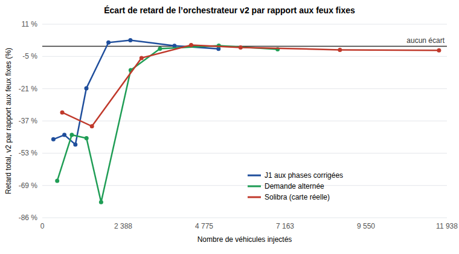

# Rapport de validation réelle

Date d’exécution : **2 octobre 2026**
Environnement : Docker 29.5, Docker Compose v5.1, hôte WSL 2 (noyau Linux 6.18) avec le
module `openvswitch` chargé ; datapath Open vSwitch utilisé en phase B : `system`.

Ce document rapporte uniquement des observations produites par les commandes du dépôt.
Les fichiers détaillés sont générés dans `results_docker/` et exclus de Git.

## Commandes exécutées

```bash
make build
make test
make test-a3 && make evaluate-30 && make test-a1w
make test-b1 && make test-b2
make test-c && make test-c30
make rapport
make test-secteurs
make demo && make replay && make test-solibra
make evaluation-equitable
make montee-en-charge
```

Toutes ces commandes se sont terminées avec le code de sortie `0`. Tests unitaires : 4/4 réussis.

## Niveau 1 : comparaison avec le mémoire

### Phase A, tableau 3.4 (graine 42)

| Indicateur | Mémoire, feux fixes | Docker, feux fixes | Mémoire, adaptatif | Docker, adaptatif |
|---|---:|---:|---:|---:|
| Véhicules écoulés sur 1 300 | 974 | 974 | 1 300 | 1 300 |
| Véhicules bloqués | 326 | 326 | 0 | 0 |
| Durée moyenne de trajet (s) | 169,1 | 169,1 | 169,0 | 169,0 |
| Temps perdu moyen (s) | 154,0 | 154,0 | 153,8 | 153,8 |

### Phase A, trente graines appariées et plan Webster

| Mesure | Mémoire | Docker |
|---|---:|---:|
| Véhicules bloqués en feux fixes, moyenne | 25,11 % | 25,11 % |
| IC 95 % | [24,97 ; 25,25] | [24,98 ; 25,24] |
| Complétion en feux adaptatifs | 100 % | 100 % |
| Complétion du plan Webster | 76,5026 % | 76,5026 % |
| IC 95 % du plan Webster | [76,4123 ; 76,5928] | [76,4123 ; 76,5928] |

La phase A est reproduite à l’identique : SUMO est déterministe à graine donnée.

### Points de protocole relevés en reproduisant la phase A

Le banc conserve volontairement le protocole du mémoire, pour en reproduire les valeurs
publiées. En le rejouant, il a relevé trois points qui faussent la comparaison entre feux
fixes et feux adaptatifs.

**1. Horizon de simulation inégal.** Les feux fixes sont simulés jusqu’à 3 600 s
(`--end 3600`) ; en mode adaptatif, l’orchestrateur fait avancer SUMO jusqu’à la sortie du
dernier véhicule. Sur la graine 42 :

| Horizon | Feux fixes | Plan Webster | Feux adaptatifs |
|---|---:|---:|---:|
| 3 600 s, identique pour tous | 974 / 1 300 | 991 / 1 300 | 979 / 1 300 |
| Jusqu’à la sortie du dernier véhicule | 1 300 à 4 803 s | 1 300 à 4 743 s | 1 300 à 4 789 s |

Les 326 véhicules non sortis à 3 600 s en feux fixes ne sont donc pas bloqués
définitivement : ils attendent, surtout avant même d’entrer dans le réseau.

**2. Phases du carrefour J1 qui se croisent.** Les indices de feu du réseau sont
0 = Nord, 1 = Est, 2 = Sud, 3 = Ouest. Le programme `one_junction.add.xml` du mémoire
(états `GGrr` et `rrGG`) met au vert Nord + Est, puis Sud + Ouest : des mouvements qui se
croisent, qui doivent se céder le passage et réduisent fortement la capacité du carrefour.
Le programme d’origine du réseau (`GrGr`, Nord + Sud) était correct mais il est remplacé.
Le plan Webster a le même défaut, et l’orchestrateur du mémoire compare les files
Nord + Sud et Est + Ouest, qui ne correspondent pas aux phases qu’il commande. Le carrefour
de Solibra est, lui, correctement défini.

**3. Absence de phase orange.** L’orchestrateur du mémoire passe directement d’un vert à
l’autre, alors que les feux fixes et le plan Webster respectent 5 s d’orange : il dispose
ainsi de quelques secondes de vert supplémentaires à chaque changement.

### Comparaison à base égale (`make evaluation-equitable`, 30 graines)

Chaque simulation tourne jusqu’à la sortie du dernier véhicule. Le retard total d’un
véhicule est son attente avant d’entrer dans le réseau plus son temps perdu dans le réseau.
L’orchestrateur v2 corrige les limites de celui du mémoire et respecte la phase orange :
c’est lui qui donne le gain loyal de la commande adaptative.


#### Carrefour J1 du mémoire (saturé, 1 300 véhicules)

| Politique | Retard total moyen (s) | Écart vs feux fixes | Vidage (s) | Sortis à 1 800 s | Sortis à 3 600 s |
|---|---:|---:|---:|---:|---:|
| Feux fixes | 1 789 | référence | 4 802 | 487 | 974 |
| Plan Webster | 1 742 | -2,6 % [-2,9 ; -2,3] | 4 706 | 496 | 995 |
| Adaptatif (mémoire) | 1 777 | -0,6 % [-0,9 ; -0,4] | 4 795 | 490 | 978 |
| Adaptatif v2 | 1 792 | 0,2 % [-0,1 ; 0,4] | 4 789 | 486 | 974 |

#### Carrefour J1, phases corrigées (Nord+Sud / Est+Ouest), demande du mémoire

| Politique | Retard total moyen (s) | Écart vs feux fixes | Vidage (s) | Sortis à 1 800 s | Sortis à 3 600 s |
|---|---:|---:|---:|---:|---:|
| Feux fixes | 291 | référence | 1 814 | 1 298 | 1 300 |
| Plan Webster | 362 | 24,6 % [23,8 ; 25,4] | 1 959 | 1 244 | 1 300 |
| Adaptatif (mémoire) | 194 | -33,5 % [-33,9 ; -33,1] | 1 727 | 1 300 | 1 300 |
| Adaptatif v2 | 227 | -22,1 % [-23,4 ; -20,7] | 1 705 | 1 300 | 1 300 |

#### Carrefour réel de Solibra (saturé, 5 852 véhicules)

| Politique | Retard total moyen (s) | Écart vs feux fixes | Vidage (s) | Sortis à 1 800 s | Sortis à 3 600 s |
|---|---:|---:|---:|---:|---:|
| Feux fixes | 2 122 | référence | 7 486 | 2 150 | 4 319 |
| Adaptatif (mémoire) | 1 941 | -8,5 % [-8,6 ; -8,4] | 6 750 | 2 422 | 4 218 |
| Adaptatif v2 | 2 106 | -0,8 % [-0,8 ; -0,7] | 5 534 | 1 890 | 3 872 |

#### Alternance sous la capacité (J1 aux phases corrigées, 1 736 véhicules, Y = 0,72)

| Politique | Retard total moyen (s) | Écart vs feux fixes | Vidage (s) | Sortis à 1 800 s | Sortis à 3 600 s |
|---|---:|---:|---:|---:|---:|
| Feux fixes | 100 | référence | 2 639 | 1 204 | 1 736 |
| Plan Webster | 87 | -13,4 % [-14,2 ; -12,6] | 2 597 | 1 220 | 1 736 |
| Adaptatif (mémoire) | 8 | -92,1 % [-92,2 ; -92,0] | 2 422 | 1 288 | 1 736 |
| Adaptatif v2 | 22 | -78,0 % [-78,6 ; -77,5] | 2 451 | 1 279 | 1 736 |


**Lecture.** Sur un carrefour correctement défini, la commande adaptative réduit nettement
le retard : de 22 % avec la demande du mémoire et de 78 % avec une demande qui alterne
entre les axes sous la capacité (orchestrateur v2). En saturation extrême (J1 aux phases
du mémoire, Solibra), aucun plan de feux ne crée de capacité et les écarts restent faibles ;
l’orchestrateur v2 vide toutefois Solibra plus tôt (5 534 s contre 7 486 s). Une partie de
l’avance de l’orchestrateur du mémoire sur la v2 vient de l’absence de phase orange.

### Montée en charge (`make montee-en-charge`, 5 graines par palier, 425 simulations)

La demande de chaque scénario est multipliée de ×0,1 à ×4, soit de 328 à 11 704 véhicules.
Chaque simulation va jusqu’à la sortie du dernier véhicule ; l’écart compare le retard total
de l’orchestrateur v2 à celui des feux fixes, graine par graine.



#### Carrefour J1, phases corrigées (Nord+Sud / Est+Ouest), demande du mémoire


| Facteur | Véhicules | Feux fixes (s) | Webster (s) | Adaptatif mémoire (s) | Adaptatif v2 (s) | Écart v2 / fixes |
|---:|---:|---:|---:|---:|---:|---:|
| ×0,25 | 328 | 16 | 13 | 2 | 8 | -46,4 % |
| ×0,5 | 652 | 23 | 44 | 6 | 13 | -44,2 % |
| ×0,75 | 976 | 141 | 193 | 9 | 72 | -49,0 % |
| ×1 | 1 300 | 290 | 365 | 194 | 229 | -21,0 % |
| ×1,5 | 1 952 | 603 | 708 | 646 | 615 | 1,9 % |
| ×2 | 2 600 | 961 | 1 128 | 1 071 | 990 | 3,0 % |
| ×3 | 3 900 | 1 741 | 2 000 | 1 912 | 1 745 | 0,2 % |
| ×4 | 5 200 | 2 517 | 2 862 | 2 748 | 2 484 | -1,3 % |

#### Alternance sous la capacité (J1 aux phases corrigées, 1 736 véhicules, Y = 0,72)


| Facteur | Véhicules | Feux fixes (s) | Webster (s) | Adaptatif mémoire (s) | Adaptatif v2 (s) | Écart v2 / fixes |
|---:|---:|---:|---:|---:|---:|---:|
| ×0,25 | 440 | 15 | 22 | 5 | 5 | -67,2 % |
| ×0,5 | 872 | 17 | 24 | 6 | 10 | -44,2 % |
| ×0,75 | 1 304 | 23 | 30 | 6 | 12 | -45,9 % |
| ×1 | 1 736 | 101 | 87 | 8 | 22 | -77,8 % |
| ×1,5 | 2 608 | 479 | 395 | 426 | 422 | -11,9 % |
| ×2 | 3 472 | 938 | 811 | 1 011 | 926 | -1,2 % |
| ×3 | 5 208 | 1 922 | 1 719 | 2 151 | 1 928 | 0,3 % |
| ×4 | 6 944 | 2 957 | 2 690 | 3 267 | 2 911 | -1,5 % |

#### Carrefour réel de Solibra (saturé, 5 852 véhicules)


| Facteur | Véhicules | Feux fixes (s) | Webster (s) | Adaptatif mémoire (s) | Adaptatif v2 (s) | Écart v2 / fixes |
|---:|---:|---:|---:|---:|---:|---:|
| ×0,1 | 588 | 24 | n/d | 16 | 16 | -33,0 % |
| ×0,25 | 1 464 | 275 | n/d | 182 | 165 | -39,9 % |
| ×0,5 | 2 928 | 856 | n/d | 718 | 806 | -5,9 % |
| ×0,75 | 4 392 | 1 452 | n/d | 1 324 | 1 460 | 0,6 % |
| ×1 | 5 852 | 2 120 | n/d | 1 943 | 2 108 | -0,6 % |
| ×1,5 | 8 780 | 3 476 | n/d | 3 249 | 3 414 | -1,8 % |
| ×2 | 11 704 | 4 826 | n/d | 4 528 | 4 727 | -2,0 % |

**Lecture.** Tant que la demande reste sous la capacité du carrefour, la commande adaptative
réduit fortement le retard : de 44 à 49 % sur J1 aux phases corrigées jusqu’à 976 véhicules,
de 44 à 78 % en demande alternée jusqu’à 1 736 véhicules, de 33 à 40 % sur Solibra jusqu’à
1 464 véhicules. Au-delà de la capacité, toutes les politiques convergent, avec des écarts
de quelques pour cent : la commande des feux répartit le vert, elle ne crée pas de
capacité. Le Webster de chaque scénario est réglé pour la demande nominale et n’est pas
recalculé à chaque palier, comme un plan fixe installé sur le terrain.

### Phase B, tableau 3.5 (120 s, flux de contrôle à 200 kbit/s, 16 Mbit/s de fond sur 5 Mbit/s)

| Mesure côté récepteur | Mémoire, sans QoS | Docker, sans QoS | Mémoire, avec QoS | Docker, avec QoS |
|---|---:|---:|---:|---:|
| Pertes moyennes | 69,6 % | 62,8 % | 0 % | 0 % |
| Débit utile reçu (Mbit/s) | 0,056 | 0,039 | 0,200 | 0,192 |
| Jitter moyen (ms) | 110,31 | 15,06 | 0,06 | 0,42 |

Les pertes et le débit utile sont du même ordre que dans le mémoire, et l’effet de la QoS
est le même : elle supprime les pertes du flux de commande et lui rend la quasi-totalité
de son débit. Le jitter absolu sans QoS est plus faible ici : le banc Docker émule le
point d’accès par une file FIFO courte (50 paquets), qui retarde peu les paquets ; le
point d’accès Wi-Fi émulé par Mininet-WiFi accumulait davantage de retard.

Trois corrections ont été nécessaires pour obtenir ces mesures (voir README, section 3.2) :
sommes de contrôle UDP calculées en logiciel sur les paires veth, datapath noyau
d’Open vSwitch (le datapath en espace utilisateur ignore `set_queue`), et files FIFO
explicites sous les classes HTB. Avant ces corrections, le récepteur ne recevait aucun
paquet UDP et la version précédente de ce rapport ne pouvait conclure sur la phase B.

### Boucle fermée

- Exécution intégrée, graine 42 : 113 changements de phase, installation de la règle
  prioritaire par Ryu observée dans `ryu.log`.
- Décision d’hystérésis sur 30 graines : priorité activée dans les 30 exécutions, active
  99,32 % du temps en moyenne (minimum 98,73 %, maximum 99,66 %), première activation à
  2 s de simulation.

## Niveau 2 : option évoluée

### Contrôleurs par secteur avec secours (`make test-secteurs`)

| Vérification | Résultat |
|---|---|
| Chaque pont connecté à son principal et à son secours | réussi |
| Le principal Nord commande la priorité (activation puis retrait) | réussi |
| Arrêt brutal du principal Nord : le secours installe la règle | réussi, en 0,02 s |
| Pertes de ping pendant la bascule | 0 % |
| Secteur Sud pendant la panne Nord | non affecté |
| Arrêt des deux contrôleurs Nord : acheminement en mode autonome | réussi |

La bascule est quasi immédiate car l’orchestrateur détecte le refus de connexion du
principal et publie aussitôt au secours, déjà connecté au commutateur.

### Démonstration sur le carrefour réel de Solibra (`make demo`, graine 42, 1 800 s)

| Mesure | Feux fixes | Feux adaptatifs |
|---|---:|---:|
| Véhicules arrivés sur 5 852 injectés | 2 150 (36,7 %) | 2 414 (41,3 %) |
| Pic de véhicules à l’arrêt | 139 | 110 |

L’écart est plus modeste qu’au carrefour J1 : la demande recalibrée dépasse la capacité
du carrefour sur les deux axes à la fois. La commande adaptative améliore l’écoulement,
elle ne crée pas de capacité.

### Campagne Solibra sur trente graines (`make test-solibra`)

| Mesure (30 graines, protocole du mémoire) | Feux fixes | Feux adaptatifs |
|---|---:|---:|
| Complétion | 73,81 % (IC 95 % [73,78 ; 73,83]) | 100 % |
| Gain apparié | | 26,19 points (IC 95 % [26,17 ; 26,22]) |

Ces valeurs suivent le protocole du mémoire et appellent la même réserve d’horizon que
la phase A (voir le point de vigilance ci-dessous).

## Limites

- Simulation (SUMO) et émulation réseau (espaces de noms Linux, Open vSwitch) : la radio
  Wi-Fi n’est pas modélisée par ce banc.
- La demande n’est calibrée sur aucun comptage réel.
- Le prototype par secteur valide le mécanisme de basculement sur deux ponts émulés ; il
  ne dimensionne pas un réseau de plusieurs centaines de carrefours.
